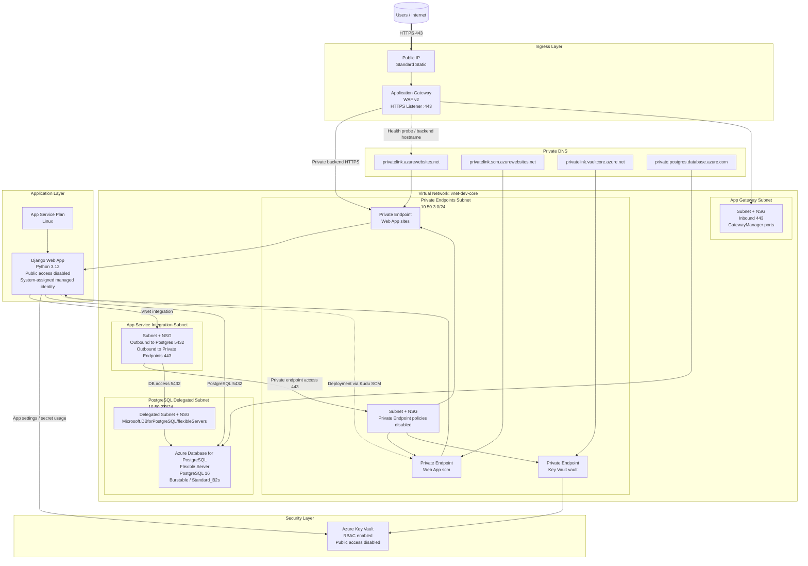
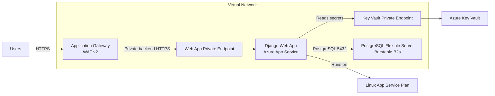
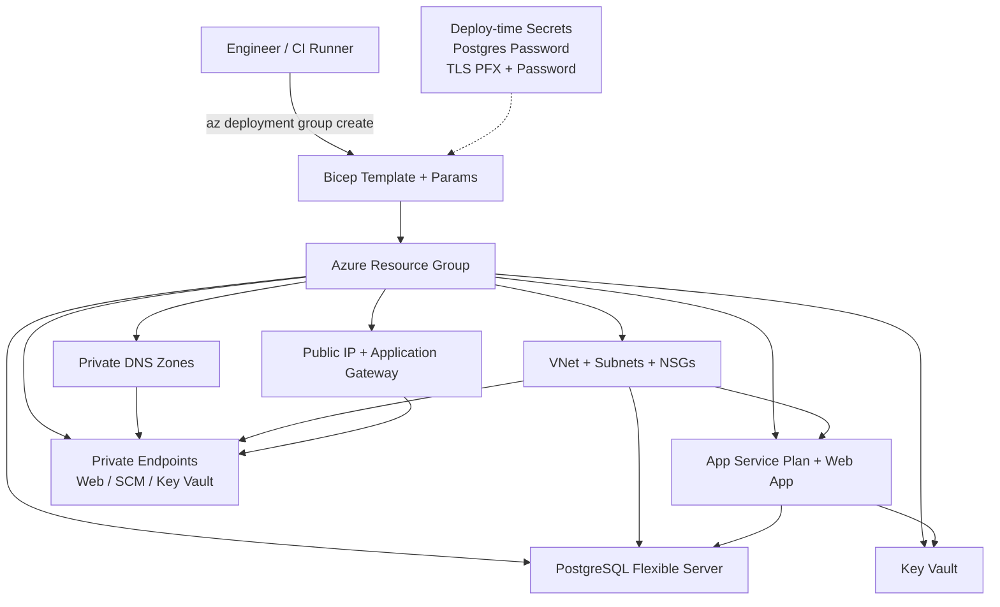
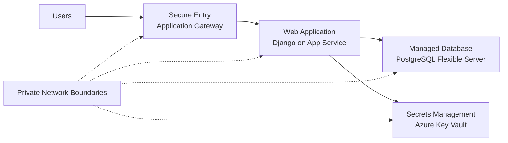
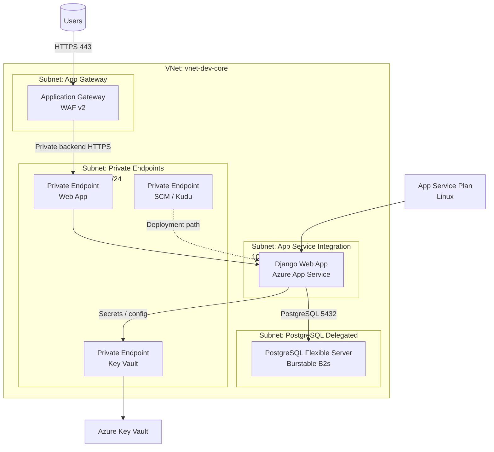

# Edu App Azure Architecture

This diagram reflects the infrastructure defined in the Bicep templates for the edu-app deployment. It shows the network boundaries, ingress path, application hosting, data tier, and private connectivity model.

## Summary

The design uses Azure Application Gateway as the public HTTPS entry point. Traffic is routed privately to an Azure App Service Linux Web App hosting the Django application. The web app is integrated with a dedicated application subnet for outbound traffic and accesses supporting services over private networking.

Azure Database for PostgreSQL Flexible Server is deployed with private access in a delegated subnet and is configured for a Burstable SKU by default for the dev environment. Azure Key Vault is exposed only through a private endpoint. Private DNS zones provide name resolution for the web app, SCM endpoint, Key Vault, and PostgreSQL.

## Architecture Diagram

## Presentation Diagram

## Deployment Flow Diagram

## Executive Overview

## VNet, Subnets, And Application Systems

## Resource Inventory

| Layer | Resource | Notes |
| --- | --- | --- |
| Ingress | Application Gateway | WAF v2, public HTTPS entry point |
| Ingress | Public IP | Standard static IP for gateway frontend |
| Compute | App Service Plan | Hosts Linux Web App |
| Compute | Web App | Django app, Python 3.12, public network disabled |
| Data | PostgreSQL Flexible Server | Private access, delegated subnet, Burstable default |
| Security | Key Vault | RBAC enabled, private endpoint only |
| Network | VNet + 4 subnets | App Gateway, App Service, DB, and Private Endpoints |
| DNS | 4 private DNS zones | Web App, SCM, Key Vault, PostgreSQL |

## Key Flows

- Users enter through Application Gateway over HTTPS.
- Application Gateway forwards traffic to the Web App through its private endpoint.
- The Web App reaches PostgreSQL through delegated private networking.
- The Web App reaches Key Vault through a private endpoint.
- Private DNS zones resolve all private endpoints and private PostgreSQL hostnames inside the VNet.

## Notes

- This is an intended-state architecture from IaC, not a discovered live-resource diagram.
- PostgreSQL is set to Burstable for dev defaults, not General Purpose.
- Deployment secrets and certificate material still need to be supplied at deploy time.
- The presentation and executive views are simplified from the engineering view for readability.